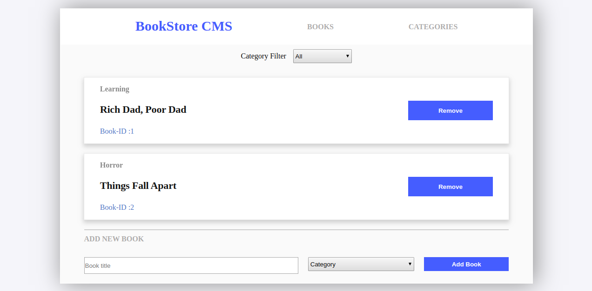

# Project Name

> This project is a book managment app build with React and Redux.

This is a simple application where the user can create a book and can filter the books they wants to see by category

## Built With

- javaScript
- React
- Redux
- Node js
- Heroku

## Live Demo

[Live Demo Link](https://book-store-t.herokuapp.com/)

## Getting Started

Here are the steps to follow in order to get this project on your local computer.

### Prerequisites

`node v12.16.3 +`

`npm v6.14.4 +`

### Setup

clone this repo by typing `git clone`

### Install

install the dependacies by typing `npm install`

### Usage

start the local server by running `npm start`

### Deployment

this project is deployed on heroku

to get the deployment build of the code run `npm run build`

## Authors

👤 **Tresor bireke**

- Github: [@Tresor11](https://github.com/Tresor11)
- Twitter: [@Tbireke](https://twitter.com/Tbireke)

👤 **Selma ndi**

- Github: [@githubhandle](https://github.com/githubhandle)
- Twitter: [@twitterhandle](https://twitter.com/twitterhandle)
- Linkedin: [linkedin](https://linkedin.com/linkedinhandle)

## 🤝 Contributing

Contributions, issues and feature requests are welcome!

Feel free to check the [issues page](issues/).

## Show your support

Give a ⭐️ if you like this project!

## Acknowledgments

- Hat tip to anyone whose code was used
- Inspiration
- etc

## 📝 License

This project is [MIT](lic.url) licensed.

